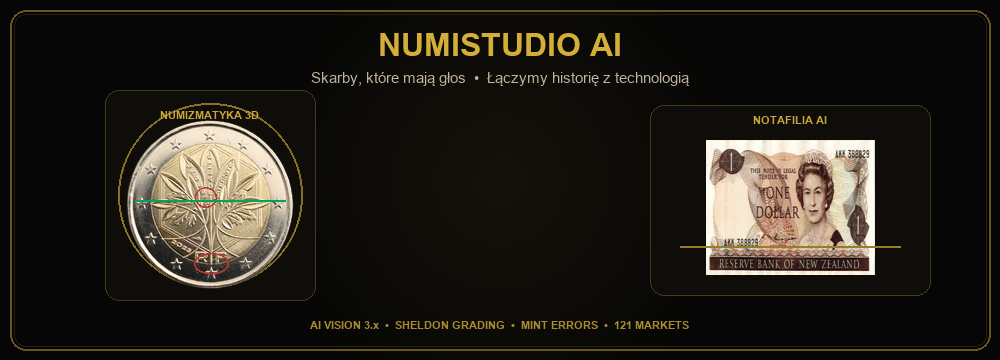

  

    

  
  
  
  

---

### 🌟 Oficjalne Moduły i Prezentacje:

* 📱 **[NumiStudio AI – Aplikacja Mobilna (Android)](https://numistudioai.pl/#aplikacja)**  
  Widzenie komputerowe nowej generacji: błyskawiczne rozpoznawanie monet, grading w skali Sheldona, detekcja odmian i destruktów menniczych oraz wycena rynkowa w oparciu o 121 rynków świata.

* 💵 **[Notafilia – Eksploracja i Analiza Banknotów](https://numistudioai.pl/#banknoty)**  
  Zaawansowane rozpoznawanie serii zastępczych (ZA/YA), numerów radarowych, znaków wodnych i mikrodruków.

* 🌐 **[NumiStudioAI.PL – Prestige Portal (12 Języków)](https://numistudioai.pl)**  
  Międzynarodowy portal demonstracyjny z silnikiem 3D, Złotym Standardem Google i obsługą 12 języków świata.

* 🏛️ **NumiStudio Desktop & Voice Engine**  
  Potężna stacja robocza dla kolekcjonerów z wielojęzycznym lektorem i silnikiem dubbingu w 26 językach.

---

### 📺 Dołącz do Społeczności na YouTube:

Zapraszam na oficjalny kanał:  
👉 **[youtube.com/@KolekcjeMonetyBibeloty](https://www.youtube.com/@KolekcjeMonetyBibeloty)**  
*Monety, banknoty, skarby z wykopalisk, ciekawostki historyczne i numizmatyka w praktyce.*

---

  © 2026 NumiStudio AI • Wszelkie prawa zastrzeżone

